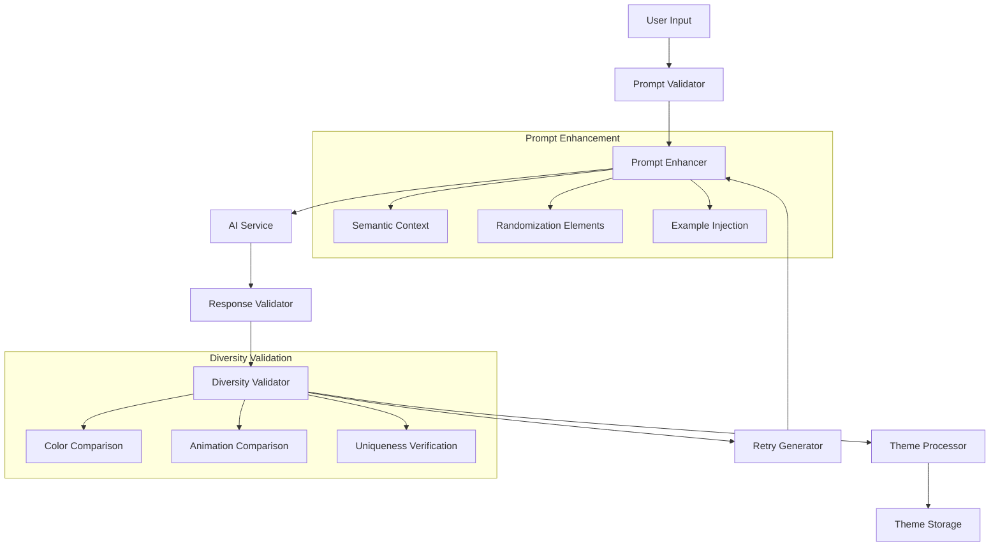

# AI Theme Diversity Fix Design Document

## Overview

The AI Theme Diversity Fix addresses a critical issue where the existing AI theme generator produces identical color palettes and animations regardless of user input prompts. This design enhances the AI prompt engineering, response validation, and theme processing pipeline to ensure each user prompt generates genuinely unique, contextually appropriate themes.

The solution focuses on three key areas: enhanced AI prompt construction with semantic context and randomization, robust response validation to detect and prevent identical themes, and improved theme processing that ensures visual diversity. The design maintains full compatibility with the existing theme system while significantly improving the quality and diversity of generated themes.

## Architecture

### Enhanced AI Theme Generation Pipeline



### Component Interaction Flow

1. **Enhanced Prompt Construction**: User input is enhanced with semantic context, randomization elements, and diversity requirements
2. **AI Processing**: Enhanced prompt sent to AI service with explicit diversity instructions
3. **Response Validation**: AI response validated for completeness and format correctness
4. **Diversity Validation**: Generated theme compared against previous themes and baseline palettes
5. **Retry Logic**: If diversity validation fails, prompt is modified and regeneration attempted
6. **Theme Processing**: Validated diverse response converted to ThemeConfig format
7. **Storage and Display**: Unique theme stored and presented to user

## Components and Interfaces

### Enhanced Prompt Builder

```typescript
interface EnhancedPromptBuilder {
  buildPrompt(userInput: string, options: PromptOptions): EnhancedPrompt;
  addSemanticContext(prompt: string): string;
  addRandomizationElements(prompt: string): string;
  addDiversityRequirements(prompt: string): string;
}

interface PromptOptions {
  includeAnimations: boolean;
  diversityLevel: 'standard' | 'high' | 'maximum';
  previousThemes?: ThemeColorSummary[];
  sessionId?: string;
}

interface EnhancedPrompt {
  systemPrompt: string;
  userPrompt: string;
  diversityContext: string;
  randomizationSeed: string;
}

interface ThemeColorSummary {
  studyPrimary: string;
  studySecondary: string;
  breakPrimary: string;
  breakSecondary: string;
  animationType?: string;
}
```

### Diversity Validator

```typescript
interface DiversityValidator {
  validateThemeDiversity(
    newTheme: AIThemeResponse, 
    existingThemes: ThemeColorSummary[]
  ): DiversityValidationResult;
  
  calculateColorDistance(color1: string, color2: string): number;
  isThemeSufficientlyUnique(theme: AIThemeResponse): boolean;
  generateDiversityReport(theme: AIThemeResponse): DiversityReport;
}

interface DiversityValidationResult {
  isUnique: boolean;
  similarityScore: number;
  conflictingThemes: string[];
  recommendations: string[];
}

interface DiversityReport {
  colorUniqueness: number; // 0-1 scale
  animationUniqueness: number; // 0-1 scale
  overallDiversity: number; // 0-1 scale
  contextualAppropriatenessScore: number; // 0-1 scale
}
```

### Enhanced AI Theme Response

```typescript
interface EnhancedAIThemeResponse extends AIThemeResponse {
  diversityMetadata: {
    colorVariation: number;
    animationComplexity: number;
    contextualRelevance: number;
    uniquenessScore: number;
  };
  generationAttempt: number;
  promptVariation: string;
}
```

## Data Models

### Theme Diversity Tracking

```typescript
interface ThemeDiversityTracker {
  sessionThemes: Map<string, ThemeColorSummary>;
  colorDistanceMatrix: number[][];
  animationPatterns: Set<string>;
  lastGenerationTime: number;
}

interface ColorDistanceCalculator {
  calculateRGBDistance(color1: string, color2: string): number;
  calculateHSLDistance(color1: string, color2: string): number;
  calculatePerceptualDistance(color1: string, color2: string): number;
}
```

### Enhanced Prompt Templates

```typescript
interface PromptTemplate {
  baseSystemPrompt: string;
  diversityInstructions: string;
  contextualExamples: Record<string, string>;
  animationGuidelines: string;
  randomizationPatterns: string[];
}

interface SemanticContextMap {
  [keyword: string]: {
    suggestedColors: string[];
    suggestedAnimations: string[];
    visualMetaphors: string[];
    moodDescriptors: string[];
  };
}
```

## Correctness Properties

*A property is a characteristic or behavior that should hold true across all valid executions of a system-essentially, a formal statement about what the system should do. Properties serve as the bridge between human-readable specifications and machine-verifiable correctness guarantees.*

<function_calls>
<invoke name="prework">
<parameter name="featureName">ai-theme-diversity-fix

### Property Reflection

After reviewing all properties identified in the prework, several can be consolidated to eliminate redundancy:

- Properties 1.1, 1.2, and 1.4 (theme uniqueness and diversity) can be combined into a comprehensive theme diversity property
- Properties 2.1, 2.2, 2.4, and 2.5 (prompt enhancement) can be consolidated into a single prompt construction property
- Properties 1.5 and 2.3 (validation against defaults) can be merged into a fallback detection property

Property 1: Theme diversity across different prompts
*For any* set of different user prompts, the system should generate themes with distinct color palettes and animations that reflect the semantic meaning of each prompt and ensure no two themes have identical color combinations
**Validates: Requirements 1.1, 1.2, 1.4**

Property 2: Contextual color appropriateness
*For any* prompt with known color associations (e.g., "sunset", "ocean", "forest"), the generated theme should incorporate contextually appropriate colors and matching animations that align with the prompt's semantic meaning
**Validates: Requirements 1.3**

Property 3: Enhanced prompt construction
*For any* user input, the constructed AI prompt should include semantic context, diversity requirements, randomization elements, and examples to encourage unique theme generation
**Validates: Requirements 2.1, 2.2, 2.4, 2.5**

Property 4: Fallback detection and prevention
*For any* generated theme, the system should validate that colors and animations differ significantly from baseline default palettes and known fallback patterns
**Validates: Requirements 1.5, 2.3**

## Error Handling

### AI Service Response Validation

The system implements comprehensive validation for AI service responses to ensure theme diversity:

**Response Completeness**: Validate all required fields (colors, animations, visual elements) are present and properly formatted
**Color Format Validation**: Ensure all colors are valid hex codes and meet accessibility requirements
**Diversity Validation**: Compare generated colors against previous themes and baseline palettes to ensure uniqueness
**Animation Validation**: Verify animation configurations are unique and contextually appropriate

### Retry Logic with Prompt Variation

**Diversity Failure Retry**: If generated theme fails diversity validation, modify prompt with additional randomization and retry
**Prompt Variation Strategies**: Use different semantic contexts, randomization seeds, and example sets for retry attempts
**Maximum Retry Limits**: Limit retry attempts to prevent infinite loops while maintaining quality standards
**Graceful Degradation**: After maximum retries, provide user feedback about diversity challenges rather than using fallback themes

### Session-Level Diversity Tracking

**Theme History Management**: Maintain session-level tracking of generated themes for diversity comparison
**Color Distance Calculation**: Use perceptual color distance algorithms to ensure sufficient visual distinction
**Animation Pattern Tracking**: Track animation types and configurations to prevent repetition
**Memory Management**: Implement efficient storage and cleanup of diversity tracking data

## Testing Strategy

### Dual Testing Approach

The testing strategy employs both unit testing and property-based testing to ensure comprehensive coverage:

**Unit Tests**: Verify specific examples, edge cases, and error conditions including:
- Specific prompt inputs and expected diverse theme outputs
- Color distance calculations and diversity metrics
- Prompt construction with various semantic contexts
- Error scenarios and retry logic behavior

**Property-Based Tests**: Verify universal properties across all inputs using **fast-check** library:
- Each property-based test will run a minimum of 100 iterations
- Tests will generate random prompts and verify diversity requirements
- Each test will be tagged with comments referencing the specific correctness property
- Format: `**Feature: ai-theme-diversity-fix, Property {number}: {property_text}**`

### Property-Based Testing Library

The system will use **fast-check** as the property-based testing library for JavaScript/TypeScript. Fast-check provides:
- Comprehensive generators for various prompt types and theme configurations
- Shrinking capabilities to find minimal failing examples for diversity issues
- Integration with existing Jest testing framework
- Support for async property testing for AI service calls

### Test Configuration

- Property-based tests configured to run minimum 100 iterations per property
- Timeout configuration for AI service tests (15 seconds to account for network delays)
- Mock AI service responses with controlled diversity for deterministic testing
- Separate integration tests for actual AI service connectivity and diversity validation

## Implementation Architecture

### Enhanced Prompt Engineering

The system uses sophisticated prompt engineering to encourage diverse theme generation:

```typescript
interface PromptEngineeringStrategy {
  buildSemanticContext(prompt: string): string;
  addDiversityInstructions(): string;
  injectRandomizationElements(seed: string): string;
  addContextualExamples(prompt: string): string[];
}
```

**Semantic Context Enhancement**: Add relevant color associations, mood descriptors, and visual metaphors based on prompt analysis
**Diversity Instructions**: Explicit instructions to AI about avoiding repetitive responses and encouraging creativity
**Randomization Elements**: Include random seeds, variation requests, and creative constraints to prevent identical responses
**Contextual Examples**: Provide relevant examples of diverse themes for similar prompts to guide AI generation

### Color Distance and Diversity Algorithms

**Perceptual Color Distance**: Use CIEDE2000 or similar algorithms for accurate color difference calculation
**Multi-Dimensional Comparison**: Compare themes across color, animation, and visual element dimensions
**Threshold Management**: Configurable thresholds for minimum diversity requirements
**Weighted Scoring**: Different weights for primary, secondary, and accent color differences

### Session Management and Caching

**Theme History Caching**: Efficient in-memory storage of generated themes for session-level diversity checking
**Color Palette Indexing**: Fast lookup structures for color comparison and conflict detection
**Animation Pattern Registry**: Track animation types and configurations to prevent repetition
**Cleanup Strategies**: Automatic cleanup of old theme data to prevent memory bloat

## Platform-Specific Considerations

### React Native Integration

**AsyncStorage Enhancement**: Extended storage for diversity tracking data and theme history
**Performance Optimization**: Efficient color distance calculations optimized for mobile performance
**Memory Management**: Careful management of theme history and diversity data to prevent memory issues
**Background Processing**: Diversity validation and prompt enhancement in background threads

### Cross-Platform Compatibility

**Consistent Algorithms**: Same diversity validation logic across iOS, Android, and web platforms
**Platform-Specific Optimizations**: Tailored performance optimizations for each platform
**Responsive Design**: Diversity validation UI adapts to different screen sizes and orientations

## Migration and Compatibility

### Backward Compatibility

**Existing Theme Support**: Full compatibility with current predefined and previously generated themes
**API Compatibility**: No breaking changes to existing theme interfaces or storage formats
**Gradual Enhancement**: Diversity features can be enabled progressively without disrupting existing functionality

### Data Migration

**Theme History Migration**: Existing generated themes analyzed and added to diversity tracking system
**Configuration Migration**: Smooth transition of existing AI service configurations
**User Preference Preservation**: Maintain existing user theme preferences during diversity system activation