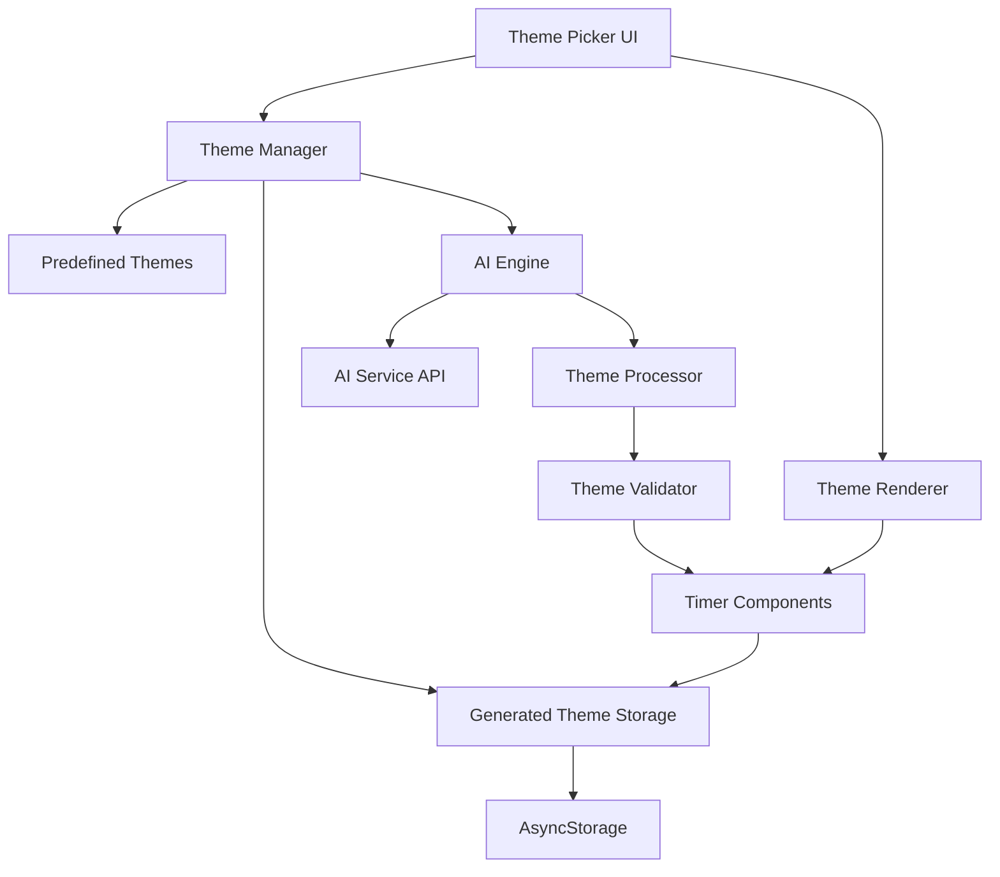

# AI Theme Generator Design Document

## Overview

The AI Theme Generator extends the existing Pomodoro timer theme system by integrating AI-powered theme generation capabilities. Users can input descriptive text prompts to create personalized themes that complement the existing predefined themes (Default, Snow, Christmas, Pokemon). The system leverages AI to interpret semantic meaning from user input and generate appropriate color palettes, visual elements, and styling that enhance the timer experience.

The design maintains full compatibility with the existing theme infrastructure while adding new capabilities for dynamic theme creation, storage, and management. Generated themes follow the same `ThemeConfig` interface and rendering pipeline as predefined themes, ensuring consistent behavior and user experience.

## Architecture

### High-Level Architecture



### Component Interaction Flow

1. **User Input**: User enters prompt in Theme Picker UI
2. **AI Processing**: AI Engine processes prompt via external AI service
3. **Theme Generation**: Theme Processor converts AI response to ThemeConfig
4. **Validation**: Theme Validator ensures accessibility and correctness
5. **Storage**: Generated theme saved to AsyncStorage via Generated Theme Storage
6. **Display**: Theme appears in picker alongside predefined themes
7. **Application**: User selects theme, applied via existing Theme Renderer

## Components and Interfaces

### AI Engine Interface

```typescript
interface AIThemeEngine {
  generateTheme(prompt: string): Promise<AIThemeResponse>;
  validatePrompt(prompt: string): PromptValidationResult;
}

interface AIThemeResponse {
  studyColors: {
    primary: string;
    secondary: string;
    accent: string;
    description: string;
  };
  breakColors: {
    primary: string;
    secondary: string;
    accent: string;
    description: string;
  };
  visualElements: {
    backgroundType: 'pattern' | 'particles' | 'gradient';
    elements: string[];
    animations?: AnimationSuggestion[];
  };
  themeName: string;
  confidence: number;
}

interface PromptValidationResult {
  isValid: boolean;
  errors: string[];
  sanitizedPrompt?: string;
}
```

### Generated Theme Storage Interface

```typescript
interface GeneratedThemeStorage {
  saveTheme(theme: GeneratedTheme): Promise<void>;
  loadThemes(): Promise<GeneratedTheme[]>;
  deleteTheme(themeId: string): Promise<void>;
  updateTheme(themeId: string, updates: Partial<GeneratedTheme>): Promise<void>;
}

interface GeneratedTheme extends ThemeConfig {
  id: string;
  originalPrompt: string;
  createdAt: number;
  isCustom: true;
}
```

### Enhanced Theme Manager Interface

```typescript
interface EnhancedThemeManager {
  // Existing functionality
  getPredefinedThemes(): Record<TimerTheme, ThemeConfig>;
  getCurrentTheme(): TimerTheme | string;
  setTheme(theme: TimerTheme | string): Promise<void>;
  
  // New AI functionality
  generateTheme(prompt: string): Promise<GeneratedTheme>;
  getGeneratedThemes(): Promise<GeneratedTheme[]>;
  deleteGeneratedTheme(themeId: string): Promise<void>;
  getAllThemes(): Promise<ThemeCollection>;
}

interface ThemeCollection {
  predefined: Record<TimerTheme, ThemeConfig>;
  generated: GeneratedTheme[];
}
```

## Data Models

### Extended Theme Configuration

The existing `ThemeConfig` interface remains unchanged to maintain compatibility. Generated themes extend this with additional metadata:

```typescript
// Existing ThemeConfig (unchanged)
interface ThemeConfig {
  name: string;
  studyColors: ThemeColors;
  breakColors: ThemeColors;
  backgroundElements?: BackgroundElement[];
  animations?: ThemeAnimations;
}

// New generated theme wrapper
interface GeneratedTheme extends ThemeConfig {
  id: string;                    // Unique identifier
  originalPrompt: string;        // User's input prompt
  createdAt: number;            // Timestamp
  isCustom: true;               // Type discriminator
  aiConfidence?: number;        // AI generation confidence score
}
```

### AI Service Integration

```typescript
interface AIServiceConfig {
  endpoint: string;
  apiKey: string;
  timeout: number;
  retryAttempts: number;
}

interface AIPromptTemplate {
  systemPrompt: string;
  userPromptTemplate: string;
  responseFormat: 'json';
  maxTokens: number;
}
```

### Theme Storage Schema

```typescript
interface ThemeStorageSchema {
  version: number;
  generatedThemes: {
    [themeId: string]: GeneratedTheme;
  };
  metadata: {
    totalGenerated: number;
    lastCleanup: number;
  };
}
```

## Correctness Properties

*A property is a characteristic or behavior that should hold true across all valid executions of a system-essentially, a formal statement about what the system should do. Properties serve as the bridge between human-readable specifications and machine-verifiable correctness guarantees.*

### Property Reflection

After reviewing all properties identified in the prework, several can be consolidated to eliminate redundancy:

- Properties 3.2, 3.3, and 3.4 (theme application) can be combined into a comprehensive theme application property
- Properties 6.1, 6.2, 6.3, 6.4, and 6.5 (system integration) can be consolidated into a single integration consistency property
- Properties 1.2 and 1.3 (input validation) can be combined into a comprehensive input validation property
- Properties 4.1 and 4.5 (theme storage and loading) can be merged into a persistence property

Property 1: Input validation consistency
*For any* text input to the theme generator, the system should accept inputs between 1-50 characters and reject empty inputs or inputs exceeding 50 characters with appropriate feedback
**Validates: Requirements 1.2, 1.3**

Property 2: Theme generation completeness
*For any* valid prompt, the AI system should generate a complete theme configuration containing distinct study and break color palettes within the specified timeout
**Validates: Requirements 1.4, 2.1**

Property 3: Accessibility compliance
*For any* generated theme, all color combinations should meet WCAG contrast ratio requirements (minimum 4.5:1) for text readability
**Validates: Requirements 2.2**

Property 4: Theme structure consistency
*For any* generated theme, the output should conform to the same ThemeConfig interface structure as predefined themes
**Validates: Requirements 6.1**

Property 5: Comprehensive theme application
*For any* generated theme selection, the system should apply the theme to all UI elements, persist it for future sessions, and update the interface immediately
**Validates: Requirements 3.2, 3.3, 3.4**

Property 6: Theme persistence and loading
*For any* set of generated themes, the system should store them persistently and reload them correctly on app startup alongside predefined themes
**Validates: Requirements 4.1, 4.5**

Property 7: Theme deletion consistency
*For any* generated theme deletion, the system should remove the theme from both storage and UI display completely
**Validates: Requirements 4.4**

Property 8: System integration consistency
*For any* generated theme, the system should handle it identically to predefined themes in terms of storage, rendering, and UI presentation
**Validates: Requirements 6.2, 6.3, 6.4, 6.5**

Property 9: Error recovery robustness
*For any* invalid AI response or generation failure, the system should apply appropriate fallback behavior and maintain system stability
**Validates: Requirements 5.5**

Property 10: Content validation
*For any* prompt input, the system should validate content appropriateness and reject invalid or inappropriate inputs with clear feedback
**Validates: Requirements 5.4**

## Error Handling

### AI Service Error Handling

The system implements comprehensive error handling for AI service interactions:

**Network Errors**: Automatic retry with exponential backoff (max 3 attempts)
**Timeout Handling**: 10-second timeout with user notification and cancellation
**Service Unavailability**: Graceful degradation maintaining existing functionality
**Invalid Responses**: Fallback to default color schemes with error logging
**Rate Limiting**: Queue management with user feedback for service limits

### Input Validation and Sanitization

**Prompt Validation**: Length limits (1-50 characters), content filtering, special character handling
**Content Safety**: Integration with content moderation APIs to prevent inappropriate themes
**Sanitization**: Input cleaning to remove potentially harmful content while preserving intent

### Storage Error Handling

**Storage Failures**: Fallback to in-memory storage with user notification
**Corruption Recovery**: Schema validation with automatic repair or reset
**Quota Management**: Storage cleanup for old themes when approaching limits

## Testing Strategy

### Dual Testing Approach

The testing strategy employs both unit testing and property-based testing to ensure comprehensive coverage:

**Unit Tests**: Verify specific examples, edge cases, and error conditions including:
- Specific prompt inputs and expected theme outputs
- Error scenarios (network failures, invalid responses, storage errors)
- UI interaction examples (theme selection, deletion, long-press actions)
- Integration points between AI service and theme system

**Property-Based Tests**: Verify universal properties across all inputs using **fast-check** library:
- Each property-based test will run a minimum of 100 iterations
- Tests will generate random valid and invalid inputs to verify system behavior
- Each test will be tagged with comments referencing the specific correctness property
- Format: `**Feature: ai-theme-generator, Property {number}: {property_text}**`

### Property-Based Testing Library

The system will use **fast-check** as the property-based testing library for JavaScript/TypeScript. Fast-check provides:
- Comprehensive generators for various data types
- Shrinking capabilities to find minimal failing examples
- Integration with existing Jest testing framework
- Support for async property testing for AI service calls

### Test Configuration

- Property-based tests configured to run minimum 100 iterations per property
- Timeout configuration for AI service tests (15 seconds to account for network delays)
- Mock AI service for deterministic testing of theme generation logic
- Separate integration tests for actual AI service connectivity

## Implementation Architecture

### AI Service Integration

The system integrates with external AI services through a configurable adapter pattern:

```typescript
interface AIServiceAdapter {
  generateTheme(prompt: string): Promise<AIThemeResponse>;
  validateService(): Promise<boolean>;
}

class OpenAIAdapter implements AIServiceAdapter {
  // OpenAI-specific implementation
}

class AnthropicAdapter implements AIServiceAdapter {
  // Anthropic-specific implementation
}
```

### Theme Processing Pipeline

1. **Input Validation**: Prompt sanitization and validation
2. **AI Processing**: External AI service call with retry logic
3. **Response Processing**: Convert AI response to ThemeConfig format
4. **Validation**: Accessibility and correctness validation
5. **Storage**: Persist generated theme with metadata
6. **UI Update**: Add theme to picker and trigger re-render

### Performance Considerations

**Caching**: Generated themes cached in memory for session duration
**Lazy Loading**: Themes loaded on-demand to reduce startup time
**Background Processing**: AI generation occurs in background with loading indicators
**Storage Optimization**: Periodic cleanup of unused generated themes

### Security Considerations

**API Key Management**: Secure storage of AI service credentials
**Content Filtering**: Multi-layer content validation to prevent inappropriate themes
**Rate Limiting**: Client-side rate limiting to prevent service abuse
**Data Privacy**: No storage of prompts beyond local device storage

## Platform-Specific Considerations

### React Native Integration

**AsyncStorage**: Leverages existing AsyncStorage for theme persistence
**Platform UI**: Consistent with existing theme picker modal presentation
**Performance**: Optimized for mobile performance with efficient re-renders
**Accessibility**: Full support for screen readers and accessibility features

### Cross-Platform Compatibility

**iOS/Android**: Consistent behavior across mobile platforms
**Web Support**: Full functionality when running on web platform
**Responsive Design**: Adapts to different screen sizes and orientations

## Migration and Compatibility

### Backward Compatibility

**Existing Themes**: Full compatibility with current predefined themes
**Storage Format**: Additive changes to storage schema with version management
**API Compatibility**: No breaking changes to existing theme interfaces

### Data Migration

**Schema Versioning**: Automatic migration of storage format when needed
**Graceful Degradation**: Fallback behavior for unsupported theme features
**User Data Preservation**: Existing user preferences and themes maintained during updates